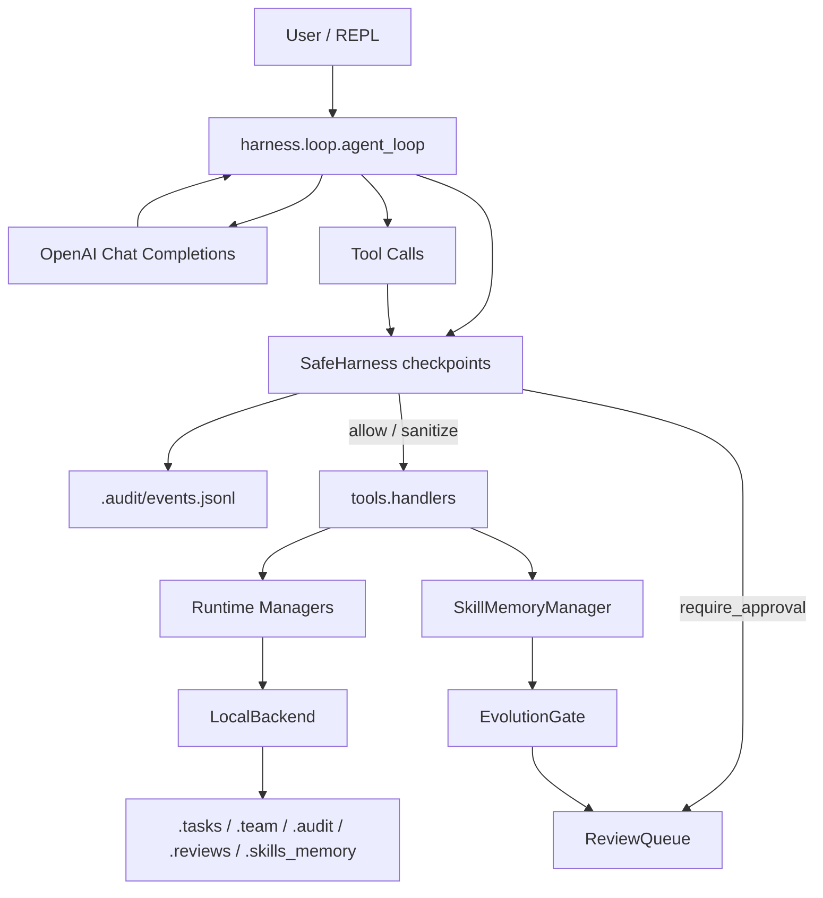
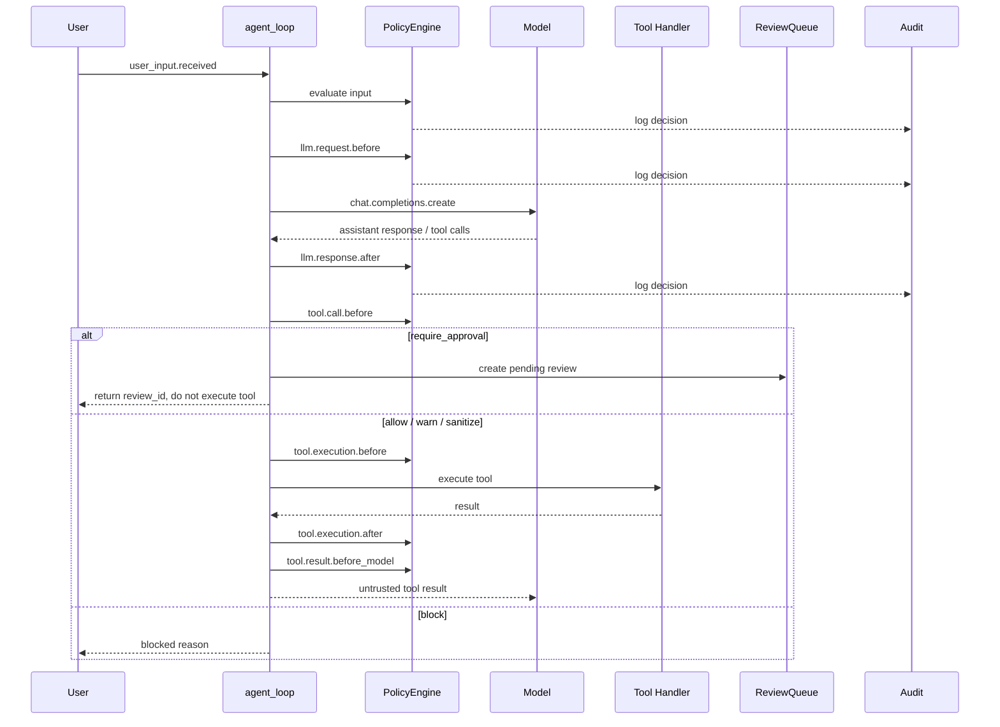
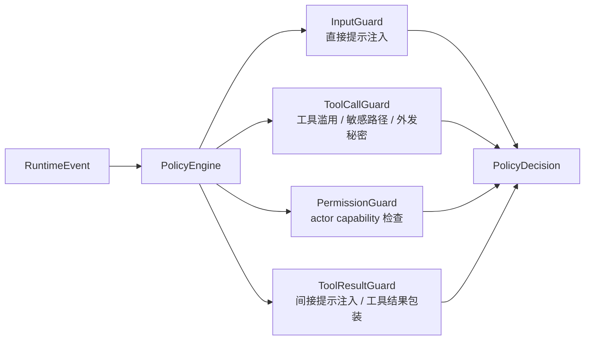
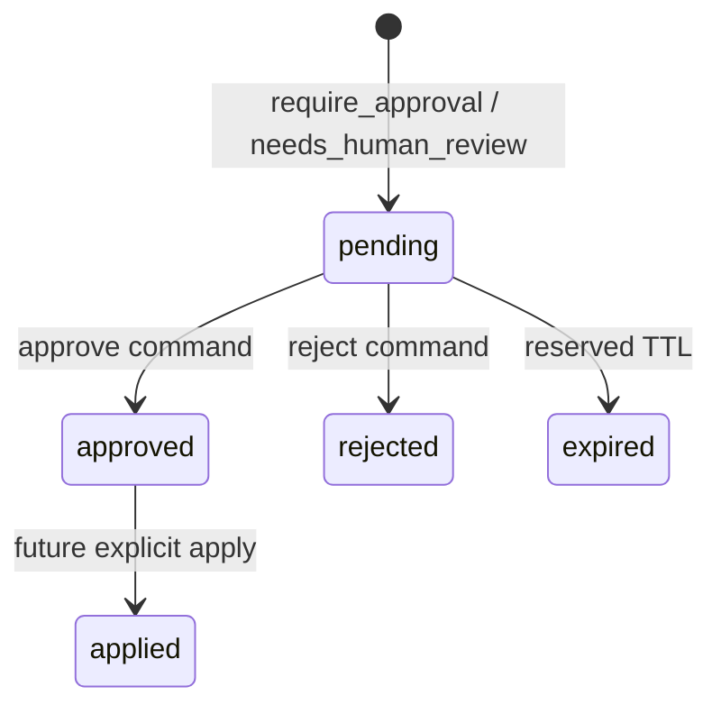
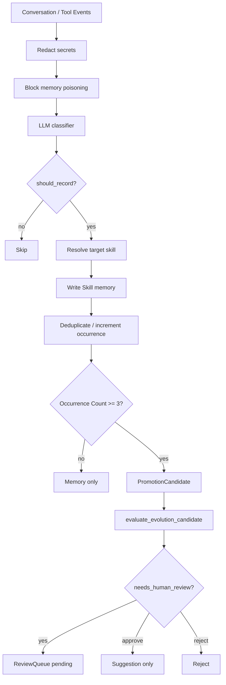

# Harness Agent

Harness Agent 是一个本地优先的 Agent Harness 实验项目，基于 OpenAI Chat Completions 工具调用接口构建。它把交互式 REPL、工具执行、文件读写、子代理、队友协作、后台任务、任务板、上下文压缩、SafeHarness 安全拦截、Skill 记忆和 self_improvement 学习闭环放在一个轻量 Python 工程里。

项目默认使用 `LocalBackend`，所有运行状态都落在本地目录中，适合原型、教学和安全机制实验。后端接口已经抽象出来，后续可以替换为 PostgreSQL、Redis、Celery、Kubernetes 等生产级基础设施。

## 总览



## 当前能力

- **交互式 Agent 循环**：读取用户输入，调用模型，执行工具调用，并把结果回传给模型继续推理。
- **工具系统**：支持 shell、文件读写与精确编辑、Todo、任务板、Skill 加载、后台任务、消息和队友管理。
- **Runtime Backend**：通过 `TaskStore`、`MessageStore`、`JobQueue`、`AgentRunner`、`ReviewStore` 隔离本地实现和运行逻辑。
- **SafeHarness**：在用户输入、模型请求/响应、工具调用、工具执行和工具结果返回前后统一做策略检查与审计。
- **人工审批队列**：`require_approval` 会创建 `.reviews/REV-*.json`，返回 `review_id`，并阻止当前工具调用执行。
- **self_improvement**：自动识别可复用学习信号，写入 Skill memory，重复出现后生成 promotion candidate，并由 Evolution Gate 做首轮评估。

## 快速开始

建议使用 Python 3.10+。

```powershell
python -m venv .venv
.\.venv\Scripts\activate
pip install -r requirements.txt
copy .env.example .env
```

编辑 `.env`：

```env
OPENAI_API_KEY=your-api-key
MODEL_ID=your-model-id
OPENAI_BASE_URL=
```

启动：

```powershell
python .\harness\agent_harness.py
```

进入 REPL 后直接输入任务即可。输入 `q`、`exit` 或空行退出。

## REPL 命令

| 命令 | 作用 |
| --- | --- |
| `/compact` | 手动压缩当前上下文 |
| `/tasks` | 查看本地任务板 |
| `/team` | 查看 teammate 状态 |
| `/inbox` | 读取 lead 收件箱 |
| `/reviews` | 列出 pending 审批项 |
| `/review <id>` | 查看审批详情 |
| `/approve <id>` | 批准审批项，生成 patch preview，但不修改目标文件 |
| `/reject <id>` | 拒绝审批项 |

## SafeHarness

SafeHarness 是运行时安全层。它不只检查用户输入，而是在 Agent 执行链路的多个中间状态生成 `RuntimeEvent`，交给 `PolicyEngine` 串联 guard 做判断，并把事件和决策写入 `.audit/events.jsonl`。

### 执行链路



### 事件和决策

当前已接入的事件：

- `user_input.received`
- `llm.request.before`
- `llm.response.after`
- `tool.call.before`
- `tool.execution.before`
- `tool.execution.after`
- `tool.result.before_model`

策略决策：

| 决策 | 行为 |
| --- | --- |
| `allow` | 继续执行 |
| `warn` | 记录风险并继续执行 |
| `sanitize` | 清洗或包装 payload 后继续 |
| `require_approval` | 创建 pending review，返回 `review_id`，不执行当前动作 |
| `block` | 阻断执行 |

### Guard 分工



- `InputGuard`：检查用户输入中的直接提示注入，例如要求忽略规则、泄露系统提示词、关闭安全。
- `ToolCallGuard`：检查 shell、后台任务、文件写入、消息发送、teammate prompt 等高风险工具调用。
- `PermissionGuard`：检查当前 actor 是否具备工具所需 capability。
- `ToolResultGuard`：把工具结果视为不可信内容，返回模型前包装为 `<untrusted_tool_result>`，并清洗间接提示注入。

### 策略模式

策略文件位于 `safety/policies/`：

- `default_policy.yaml`：本地开发默认策略，保留较完整的 lead 能力。
- `high_security_policy.yaml`：更严格的策略，未知工具、危险命令和敏感路径会被阻断或进入审批。

切换策略：

```powershell
$env:SAFETY_POLICY="high_security"
python .\harness\agent_harness.py
```

敏感变更必须进入审批队列，包括 `SKILL.md`、`AGENTS.md`、`safety/**`、`tools/**`、`harness/prompt.py` 等。批准 review 会生成 patch preview，但不会自动修改文件。

### 人工审批队列

当 `decision.action == require_approval` 时，SafeHarness 会创建 review item，而不是把决策降级成普通 block。



review item 保存在 `.reviews/REV-*.json`，核心字段包括 `review_id`、`type`、`source`、`tool_name`、`tool_arguments`、`event_type`、`target_skill`、`candidate_id`、`target_files`、`reason`、`risk_type`、`severity`、`proposed_change`、`evaluation_plan`、`rollback_plan`、`status` 和 `created_at`。

当前实现支持查看、批准、拒绝。批准会把状态改为 `approved` 并写出 patch preview；`approved` 不会自动 apply patch。

## self_improvement 闭环

`skills/self_improvement/SKILL.md` 是跨 Skill 的学习管理器。它负责把用户纠正、工具失败、能力缺口、API 变化、安全策略候选、回归测试建议和重复出现的问题，转成可追踪的 Skill memory。它只记录和提出候选，不直接修改长期规则或关键运行文件。

### 自动捕获

Agent 循环会在两类时机调用 `classify_and_record_learning_signal`：

- 模型没有工具调用、直接回复之后。
- 一轮工具调用执行完、工具结果回到对话之后。

这个统一入口会按顺序做四件事：

1. 对原始内容、最近对话、工具事件和模型消息做 secret 脱敏。
2. 拦截明显的 prompt injection、审批绕过、关闭安全、保存 token 等 memory poisoning 内容。
3. 调用 LLM-backed classifier，得到 `should_record`、`record_type`、`target_skill`、`reason`、`attribution_confidence`、`title`、`content`。
4. 当 `should_record=true` 时，调用对应的 memory 写入方法：`record_learning`、`record_error`、`record_feature_request`、`record_policy_candidate` 或 `record_regression_test`。

这意味着当前自动学习已经走 `classify_and_record_learning_signal` 的统一路径，不是旧的“先 classify，再由外层手动 record”。

### 归属优先级

自动归属优先级与 `runtime/learning_signal.py` 保持一致：

1. 如果 `attribution_confidence=low`，直接写入 `self_improvement`，并标记 `Needs Attribution Review: true`。
2. 否则优先使用 classifier 返回的 `target_skill`。
3. 如果 classifier 没有给出目标，再使用显式 `skill_name`。
4. 如果仍没有目标，再使用最近成功加载的 `last_loaded_skill`。
5. 最后回退到 `self_improvement`，并标记需要归属复核。

每条自动 memory 都会写入 `Target Skill`、`Source Skill`、`Attribution Reason`、`Attribution Confidence` 和 `Needs Attribution Review`。低置信度不会强行归给最近加载的 Skill，这是为了避免把跨 Skill 学习误写到错误位置。

### 去重和候选

Skill memory 使用 markdown 文件保存，并在写入前做简单去重。相似记录不会无限追加，而是更新已有记录：

- 增加 `Occurrence Count`。
- 根据重复次数提升优先级。
- 记录相关来源。
- 当 `Occurrence Count >= 3` 时标记为 `recurring`。

重复模式达到阈值后，系统会生成或复用 `.skills_memory/PROMOTION_CANDIDATES.md` 中的 `PromotionCandidate`。候选包含 `candidate_id`、来源 `record_id`、目标 Skill、建议变更摘要、目标文件、预期改进、风险类型、严重程度、`evaluation_plan` 和 `rollback_plan`。

也可以通过 `propose_memory_promotion(skill_name, record_id)` 手动生成候选。

### Evolution Gate

`evaluate_evolution_candidate(candidate_id)` 会加载 promotion candidate，估算 `correctness_gain`、`safety_gain`、`regression_risk`、`overblocking_risk` 和 `cost_increase`，然后返回 `reject`、`approve` 或 `needs_human_review`，并写入 `.audit/evolution.jsonl`。这里的 `approve` 只是“建议通过”，不会自动应用 patch。

以下目标必须进入人工审查：

- `SKILL.md`
- `AGENTS.md`
- `safety/**`
- `tools/**`
- `harness/prompt.py`

当评估结果是 `needs_human_review` 时，系统会自动创建 `.reviews/REV-*.json`。审批通过会生成 patch preview，但仍不会自动修改文件。

### 学习闭环图



## 本地目录

运行时会生成以下本地状态目录，均应保持未提交：

| 路径 | 内容 |
| --- | --- |
| `.tasks/` | 本地任务板 |
| `.team/` | teammate 配置与 inbox |
| `.transcripts/` | 压缩前对话记录 |
| `.audit/` | SafeHarness 审计日志 |
| `.reviews/` | 人工审批队列 |
| `.skills_memory/` | 全局 Skill memory 与 promotion candidates |
| `skills/*/memory/` | 单个 Skill 的 memory |

## 项目结构

```text
self-evolving/
├─ harness/                 # REPL、主循环、prompt、任务、消息、后台任务和 teammate 管理
├─ runtime/                 # backend 抽象、Skill 加载、Skill memory、Evolution Gate、ReviewQueue
├─ safety/                  # SafeHarness 事件、决策、策略、guard 和审计
├─ tools/                   # OpenAI tool schema 与 handler 分发
├─ skills/                  # Skill 定义与 eval 占位
├─ docs/                    # 设计文档、变更记录和历史 notes
└─ tests/                   # self_improvement 等单元测试
```

## 常用验证

```powershell
python -m unittest tests/test_self_improvement_loop.py
python -m compileall harness runtime tools safety
"q" | python .\harness\agent_harness.py
```

如果修改了安全策略、审批队列、Evolution Gate 或 self_improvement，请优先跑上面的验证。更详细的架构说明见 `docs/README.md`、`docs/HARNESS_DESIGN.md`、`docs/SAFEHARNESS_DESIGN.md` 和 `docs/RUNTIME_BACKEND_DESIGN.md`。
