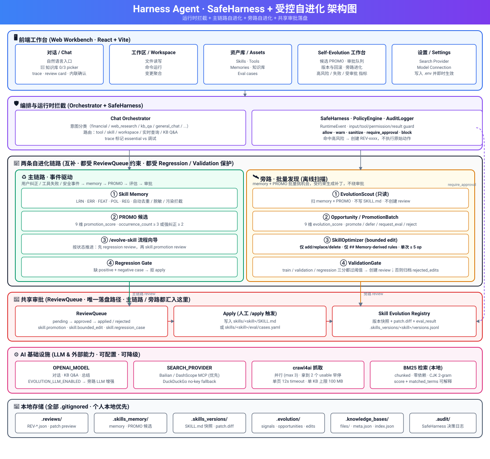
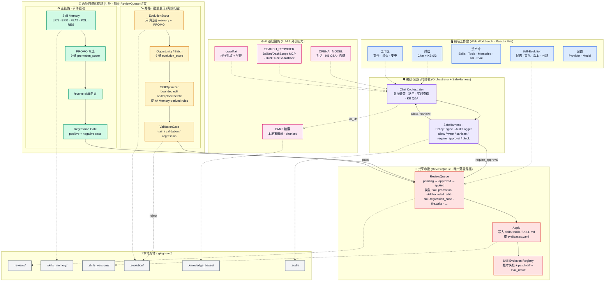

# Harness Agent

本地优先的 **SafeHarness + Self-Evolving Skills** 实验系统。

不让 Agent 无约束地修改自己，而是验证一条 **受控自进化** 链路。

## 系统架构图

<p align="center">
  
</p>

<details>
<summary>架构图（mermaid 备选，文本编辑器友好）</summary>


```mermaid
flowchart TB

  %% =========== L1: Frontend ===========
  subgraph L1["🖥️ 前端工作台 (Web Workbench · React + Vite)"]
    direction LR
    L1A["对话<br/>Chat + KB 0/3"]
    L1B["工作区<br/>文件 · 命令 · 变更"]
    L1C["资产库<br/>Skills · Tools · Memories · KB · Eval"]
    L1D["Self-Evolution<br/>候选 · 审批 · 版本 · 旁路"]
    L1E["设置<br/>Provider · Model"]
  end

  %% =========== L2: Orchestrator + SafeHarness ===========
  subgraph L2["🛡️ 编排与运行时拦截 (Orchestrator + SafeHarness)"]
    direction LR
    L2A["Chat Orchestrator<br/>意图分类 · 路由 · 实时查询 · KB Q&A"]
    L2B["SafeHarness · PolicyEngine · AuditLogger<br/>allow / warn / sanitize / require_approval / block"]
  end

  %% =========== L3: TWO evolution loops side by side ===========
  subgraph L3["🧬 两条自进化链路 (互补 · 都受 ReviewQueue 约束)"]
    direction LR

    subgraph L3A["♻️ 主链路 · 事件驱动"]
      direction TB
      L3A1["Skill Memory<br/>LRN · ERR · FEAT · POL · REG"]
      L3A2["PROMO 候选<br/>9 维 promotion_score"]
      L3A3["/evolve-skill 向导"]
      L3A4["Regression Gate<br/>positive + negative case"]
      L3A1 --> L3A2 --> L3A3 --> L3A4
    end

    subgraph L3B["🛰️ 旁路 · 批量发现 (离线扫描)"]
      direction TB
      L3B1["EvolutionScout<br/>只读扫描 memory + PROMO"]
      L3B2["Opportunity / Batch<br/>9 维 evolution_score"]
      L3B3["SkillOptimizer<br/>bounded edit<br/>add/replace/delete<br/>仅 ## Memory-derived rules"]
      L3B4["ValidationGate<br/>train / validation / regression"]
      L3B1 --> L3B2 --> L3B3 --> L3B4
    end
  end

  %% =========== L4: Shared approval (唯一落盘路径) ===========
  subgraph L4["🚦 共享审批 (ReviewQueue · 唯一落盘路径)"]
    direction LR
    L4A["ReviewQueue<br/>pending → approved → applied<br/>类型: skill.promotion · skill.bounded_edit ·<br/>skill.regression_case · file.write · ..."]
    L4B["Apply<br/>写入 skills/&lt;skill&gt;/SKILL.md<br/>或 eval/cases.yaml"]
    L4C["Skill Evolution Registry<br/>版本快照 + patch.diff + eval_result"]
  end

  %% =========== L5: AI infra ===========
  subgraph L5["⚙️ AI 基础设施 (LLM & 外部能力)"]
    direction LR
    L5A["OPENAI_MODEL<br/>对话 · KB Q&A · 总结"]
    L5B["SEARCH_PROVIDER<br/>Bailian/DashScope MCP<br/>· DuckDuckGo fallback"]
    L5C["crawl4ai<br/>并行抓取 + 早停"]
    L5D["BM25 检索<br/>本地零依赖 · chunked"]
  end

  %% =========== L6: Local storage ===========
  subgraph L6["💾 本地存储 (.gitignored)"]
    direction LR
    L6A[".reviews/"]
    L6B[".skills_memory/"]
    L6C[".skills_versions/"]
    L6D[".evolution/"]
    L6E[".knowledge_bases/"]
    L6F[".audit/"]
  end

  %% =========== Wiring ===========
  L1A -.-> L2A
  L1B -.-> L2A
  L1D -.-> L4A

  L2A --> L2B
  L2B -->|allow / sanitize| L2A
  L2B -->|require_approval| L4A

  L3A4 --> L4A
  L3B4 -->|pass| L4A
  L3B4 -.->|reject| L6D

  L4A --> L4B --> L4C

  L2A -.->|kb_ids| L5D
  L5A -.-> L2A
  L5B -.-> L2A
  L5C -.-> L2A

  L4A -.-> L6A
  L4B -.-> L6C
  L3A1 -.-> L6B
  L3B1 -.-> L6D
  L5D -.-> L6E
  L2B -.-> L6F

  classDef l1 fill:#dbeafe,stroke:#2563eb,stroke-width:1.5px,color:#0f172a
  classDef l2 fill:#ede9fe,stroke:#7c3aed,stroke-width:1.5px,color:#0f172a
  classDef l3a fill:#d1fae5,stroke:#059669,stroke-width:1.5px,color:#0f172a
  classDef l3b fill:#fef3c7,stroke:#d97706,stroke-width:1.5px,color:#0f172a
  classDef l4 fill:#fee2e2,stroke:#dc2626,stroke-width:1.5px,color:#0f172a
  classDef l5 fill:#fce7f3,stroke:#db2777,stroke-width:1.5px,color:#0f172a
  classDef l6 fill:#f3f4f6,stroke:#475569,stroke-width:1.5px,color:#0f172a

  class L1A,L1B,L1C,L1D,L1E l1
  class L2A,L2B l2
  class L3A1,L3A2,L3A3,L3A4 l3a
  class L3B1,L3B2,L3B3,L3B4 l3b
  class L4A,L4B,L4C l4
  class L5A,L5B,L5C,L5D l5
  class L6A,L6B,L6C,L6D,L6E,L6F l6
```

</details>

**图例**：🖥️ 前端 · 🛡️ 编排/拦截 · ♻️ 主链路自进化 · 🛰️ 旁路自进化 · 🚦 审批落盘 · ⚙️ AI 基础设施 · 💾 本地存储

**两条进化链路的分工**：

| 维度 | ♻️ 主链路 | 🛰️ 旁路 |
|---|---|---|
| 触发 | 事件驱动（用户纠正 / 工具失败 / 安全事件） | 离线批量扫描（`/evolution-scan` 触发） |
| 准入门槛 | `occurrence_count ≥ 3`（强纠正 ≥ 2） | 单次 safety 事件即可（safety_gain 优先通道） |
| 改 SKILL.md 范围 | 整篇可编辑 | 仅 `## Memory-derived rules` 节 · 仅 `add/replace/delete` · 单次 ≤ 5 op |
| 退化保护 | Regression Gate（positive + negative case） | ValidationGate（train / validation / regression 三分） |
| 自动化 | `/evolve-skill` 推进 | Scout 一次扫描多个 Opportunity，可批量 |
| 共享 | **同一 ReviewQueue · 同一 Skill Evolution Registry · 同一 Approve+Apply** |

核心原则：memory / PROMO / patch 都可以自动提议，但 **`SKILL.md` 的真实修改必须经过回归测试、人工审批、显式 apply 和版本登记**。

## 快速开始

Python 3.10+。

```bash
python -m venv .venv
# Linux / macOS
source .venv/bin/activate
# Windows PowerShell
# .\.venv\Scripts\activate
pip install -r requirements.txt
cp .env.example .env   # Windows: copy
```

最少配置 `.env`：

```env
OPENAI_API_KEY=...
MODEL_ID=...                 # CLI / agent_harness 使用
OPENAI_MODEL=                # web server / chat orchestrator 使用（可与 MODEL_ID 同值）
OPENAI_BASE_URL=

# Chat 实时查询的搜索 provider（优先级：Bailian / DashScope > DuckDuckGo no-key fallback）
SEARCH_PROVIDER=bailian
DASHSCOPE_API_KEY=...
SEARCH_TOOL_NAME=auto        # MCP tool 自动发现；或固定如 alibaba_web_search

# 旁路 Scout / Optimizer 默认 deterministic；接 LLM：
# EVOLUTION_LLM_ENABLED=1
```

启动 CLI：

```bash
python harness/agent_harness.py
```

启动 Web 工作台（FastAPI + Vite）：

```bash
uvicorn web.server:create_app --factory --reload --port 8000
cd web/ui && npm install && npm run dev
```

## REPL 命令

| Command | Description |
| --- | --- |
| `/reviews` / `/review <id>` / `/approve <id>` / `/apply <id>` / `/reject <id>` | ReviewQueue 操作 |
| `/promotions` / `/promotion <promo_id>` | 列出 / 查看 PROMO |
| `/evolve-skill <promo_id>` | 推进 PROMO 到下一步（regression / skill.promotion） |
| `/skill-versions <skill>` / `/skill-version <skill> <ver>` / `/rollback-skill <skill> <ver>` | 版本与回滚 |
| `/evolution-scan` / `/evolution-opportunities` / `/evolution-opportunity <id>` | Scout 旁路 |
| `/promotion-batches` / `/promotion-batch <id>` / `/promotion-batch-create <opp_id...>` | Batch 合并 |
| `/skill-optimize <batch_id>` / `/skill-edits` / `/skill-edit <id>` / `/skill-edit-validate <id>` / `/rejected-edits` | Optimizer 旁路 |
| `/compact` / `/tasks` / `/team` / `/inbox` | 上下文 / 任务 / 队友 / 消息 |

## 主链路细节

### SafeHarness
`RuntimeEvent` → `PolicyEngine` → 返回 `allow / warn / sanitize / require_approval / block`，决定经 `AuditLogger` 落盘到 `.audit/`。命中 `require_approval` 时不执行原始动作，转而创建 `REV-xxxx`。切策略：`SAFETY_POLICY=high_security python harness/agent_harness.py`。

### ReviewQueue
落盘位置：`.reviews/REV-*.json`（item）+ `.reviews/patches/REV-*.diff`（patch preview）。状态：`pending → approved → applied / rejected`。`/approve` 只生成 diff 不改文件，`/apply` 才落盘。`load_skill` 类无文件 review 在 `/apply` 时执行 load 并设 `last_loaded_skill`；`edit_file` `old_text=""` 会拒绝生成可应用的伪 diff。

### Skill Memory
入口 `classify_and_record_learning_signal`：自动归属 / 脱敏 / 去重 / 污染拦截。落盘到 `skills/<skill>/memory/{LEARNINGS,ERRORS,FEATURE_REQUESTS,POLICY_CANDIDATES,REGRESSION_TESTS}.md`。**不沉淀**：secret · token · prompt injection · bypass approval · disable safety · 一次性偏好。

### PROMO 候选

相似 memory 合并并累计 `occurrence_count`。综合 `promotion_score` 决定升级路径：

| 触发 | 输出 |
|---|---|
| `occurrence_count ≥ 3` + 可迁移 + 低风险 | `skill_rule` PROMO |
| 强纠正（"以后/固定/默认/不要再/可复用"）+ 可测试，`occurrence_count ≥ 2` | `skill_rule` PROMO |
| high-severity safety / `policy_candidate` | `policy_review`（**不直接进 SKILL.md**） |
| 低归属置信度 / secret / 注入 / bypass approval / disable safety | 不生成 |

PROMO 存 `.skills_memory/PROMOTION_CANDIDATES.md`。

### `/evolve-skill <promo_id>`
流程向导，按状态推进 — 缺 regression → 创建 `skill.regression_case` review；有 coverage → 创建 `skill.promotion` review；已完成 → 显示版本。**全程不绕 ReviewQueue，不静默改 `SKILL.md`**。

### Regression Gate

两层把关：

1. **覆盖检查** — `skill.promotion` apply 前必须在 `skills/<skill>/eval/cases.yaml` 找到该 PROMO 的 positive case（新规则生效）+ negative case（不污染其他任务）。缺失 → apply 拒绝。
2. **Eval 运行**（`runtime/skill_eval_runner.py`）— `skill.promotion` / `skill.bounded_edit` apply **写盘之前**对 *proposed* SKILL.md 跑一次 `cases.yaml`。失败 → apply 拒绝，文件不动。通过的 `RunReport`（pass/fail、失败原因、`covered_promo_ids`、`covered_rules`）写入 `eval_result.json`。

每条 case 的字段（新旧别名都接受）：

| 字段 | 含义 |
|---|---|
| `id` | case 标识 |
| `input` | 示例输入（信息字段，记录用） |
| `expected_behavior`（别名 `must_include`） | 期望 *agent 输出* 包含的 token |
| `negative_assertions`（别名 `must_not_include`） | 期望 *agent 输出* 不包含的 token |
| `target_rule` | 本 case 守护的具体规则，必须出现在 `## Memory-derived rules` |
| `source_promo_id` | 追溯到 PROMO |

> Deterministic 模式只校验 SKILL.md 文本层面：`target_rule` 是否落到 `## Memory-derived rules`。`expected_behavior` / `negative_assertions` 描述的是 *agent 运行时输出*，文本检测无法保真复现，因此 *记录但不强制*；这部分要等 LLM evaluator 上线（runner 接口已留好）。

### Skill Evolution Registry
`skill.promotion` apply 成功后写 `.skills_versions/<skill>/`：`versions.jsonl` + `<version>/{SKILL.md, patch.diff, eval_result.json}`。**Runtime 加载源始终是 `skills/<skill>/SKILL.md`**；`.skills_versions/` 仅用于审计与回滚（rollback 也走 review）。

### 端到端示例

```text
/promotions
/evolve-skill PROMO-F2C535BB    # → REV regression_case
/approve REV-xxxx
/apply REV-xxxx
/evolve-skill PROMO-F2C535BB    # → REV skill.promotion
/approve REV-yyyy
/apply REV-yyyy                 # → recorded skill version v0.1.1
/skill-versions markdown_writer
```

## 旁路 Scout + Optimizer

旁路是主链路的**离线批量补丁**通道。Scout 只读扫描可进化的机会；Optimizer 受约束生成 bounded edit；ValidationGate 拦截退化；通过则汇入主链路 ReviewQueue。三层硬约束：

- **Scout 只读** — 扫 `.skills_memory/`、`skills/*/memory/`、`PROMOTION_CANDIDATES.md`；不写 `SKILL.md` / `eval/cases.yaml`；不创建 review；不改 evaluator / scorer / regression gate
- **Optimizer 受约束写** — 仅在 `.evolution/skill_edits/` 草拟；`edit_ops ∈ {add, replace, delete}`；`target_section == "## Memory-derived rules"`；单次 ≤ 5 op，每 op ≤ 500 字符；对象上没有 `apply` / `write_skill`；**`decision in {quarantine, safety_review}` 或 signal `quarantined=True` 一律拒绝提案**
- **ValidationGate 把守** — 失败 → `.evolution/rejected_edits/` 归档，不创建 review；通过 → `submit_review` 创建 `skill.bounded_edit` review，由人审批后 apply

### Scout 四段式判断

Scout 把每条 memory 走四个阶段，决定它最终落到哪个决策桶里。源码：`runtime/evolution_scout.py`。

```text
① 信号采集 + 硬过滤   → 攻击载荷脱敏后归档，禁入 Optimizer
② 语义标签 (9 类)     → 给信号打可解释的语义标签
③ 跨 skill 聚类       → 共享 cluster_key，先聚类后挑 target_skill
④ 证据 × 价值 × 风险  → 三个独立分数代替单一 score
⑤ 决策矩阵            → 六桶决策：promote / request_eval / defer
                          / reject / safety_review / quarantine
```

#### ① 信号采集 + 硬过滤

| 项 | 规则 |
|---|---|
| 扫描文件 | 全局：`.skills_memory/GLOBAL_{LEARNINGS,ERRORS,FEATURE_REQUESTS}.md` + `PROMOTION_CANDIDATES.md`；按 skill：`skills/<skill>/memory/{LEARNINGS,ERRORS,FEATURE_REQUESTS,POLICY_CANDIDATES,REGRESSION_TESTS}.md` |
| 攻击检测 | `ATTACK_PATTERNS` 按攻击类型分类：提示注入 · 绕过审批 · 关闭安全 · 密钥外泄 |
| 隔离规则 | 命中攻击载荷 → 信号标记 `quarantined=True`，content 中的攻击短语原地替换为 `[REDACTED_ATTACK:<类型>]`，但 `source_path` / `source_ref` 完整保留可追溯 |
| 防御性事件 | 攻击载荷出现在 error 记录里且配 `blocked / rejected / 已拦截` 等防御标记 → 不全隔离，仅打 `security_incident` 标签走 safety_review |
| 强纠正强度 | 命中 `以后 (0.9) / 固定 (0.9) / 默认 (0.8) / 不要再 (0.95) / from now on (0.95) / always (0.9) / must not (0.85) / …`；`≥ 0.7` 自动追加 `user_correction` 标签 |
| 去重 | `(source_path, source_ref)` 唯一、幂等；re-scan 会刷新标签但不重建 `signal_id` |
| 内容截断 | content 上限 1500 字符 |

#### ② 语义标签（9 类，取代旧的单一 `safety` 标签）

| 标签 | 触发条件 |
|---|---|
| `security_incident` | 攻击词汇出现在防御性报告里（defended event） |
| `governance_related` | 命中 `审批 / approval / reviewqueue / 审计` |
| `memory_poisoning` | 隔离判定时自动追加 |
| `policy_related` | 命中 `policy / 策略 / guideline / 规范` |
| `rollback_related` | 命中 `rollback / 回滚 / 撤销` |
| `tool_failure` | 命中 `traceback / exception / failed / 报错 / 异常` |
| `user_correction` | 强纠正强度 ≥ 0.7 |
| `format_preference` | 命中 `markdown / yaml / json / 格式 / 结构 / 模板` |
| `capability_gap` | 命中 `missing capability / not supported / cannot / 需要支持` |

> 关键修正：`approval / policy / review` 等普通治理词**只**打 `governance_related` / `policy_related`，**不**升级为 `security_incident` —— 普通治理词不会再被误判为攻击。

#### ③ 跨 skill 聚类

```text
旧：按 (target_skill, cluster_key) 分组   → 可迁移度几乎用不上
新：先按 cluster_key 全局聚类             → 同类问题跨 skill 自然汇合
     ↓
   统计聚类内 observed_skill 分布         → 设置 cross_skill 标志
     ↓
   选 target_skill（出现次数最多，平手时优先非 self_improvement）
```

| 观察到的 skill 数 | 可迁移度 (`transferability`) |
|---|---|
| ≥ 3 个 | 1.0 |
| 2 个 | 0.85 |
| 1 个 skill + 跨切关注点标签（`format_preference` / `capability_gap` / `tool_failure` / `governance_related`） | 0.65 |
| 1 个 skill 且无跨切关注点标签 | 0.40 |

#### ④ 证据 × 价值 × 风险

**证据质量 `evidence_quality`**（取值 0..1）

| 子项 | 权重 | 取值 |
|---|---|---|
| 来源可靠度 | 0.30 | PROMO 1.0 / error 0.8 / learning 0.7 / 其他 0.5–0.6 |
| 独立出现次数 | 0.25 | `min(1, 唯一 source_ref 数 / 3)` |
| 用户纠正强度 | 0.25 | 聚类内 `correction_strength` 最大值 |
| 失败可复现度 | 0.10 | 含 `tool_failure` 且独立出现 ≥ 2 → 0.8；只含 `tool_failure` → 0.5；其他 0.3 |
| 调用链支撑 | 0.10 | 任一信号带 `tool:*` 标签 → 0.7；否则 0.3 |

**价值分 `value_score`** = `0.25·证据 + 0.15·{频率, 可迁移度, 影响, 可测试度} + 0.10·skill_confidence + 0.05·safety_gain`

**风险分 `risk_score`** = `0.25·回归风险 + 0.20·{过拟合风险, 策略风险} + 0.15·范围风险 + 0.10·{成本增量, 不确定性}`

| 风险子项 | 取值 |
|---|---|
| 回归风险 | 聚类含 PROMO → 0.3；否则 0.4 |
| 过拟合风险 | `Σf ≤ 1` → 0.6；低优先级且 `Σf < 3` → 0.5；其他 0.2 |
| 策略风险 | 含治理/策略标签且无 PROMO 背书 → 0.5；其他 0.15 |
| 范围风险 | 含 `capability_gap` → 0.55；其他 0.30 |
| 成本增量 | 常量 0.10 |
| 不确定性 | 证据 < 0.5 → 0.30；其他 0.15 |

**可测试度 `testability`**（复合分；取代旧的"是否含 PROMO"二值判断）

| 子项 | 贡献（上限） |
|---|---|
| 含非元标签（即有具体的 should_improve 候选） | +0.20 |
| 含 security / governance / policy 标签（即有具体的 must_not_regress） | +0.15 |
| `0.30 × correction_strength` | +0.30 |
| 含 `format_preference` 或 `capability_gap`（可判定的输出形态） | +0.25 |
| 含 `tool_failure` 且独立出现 ≥ 2（可复现的负例） | +0.20 |
| 含 PROMO 背书 | +0.10 |

总分 clamp 到 [0, 1]。

#### ⑤ 决策矩阵（自顶向下，先匹配先用）

| 触发条件 | 决策 | 优先级 |
|---|---|---|
| 含 `security_incident` 标签 | `safety_review` | **高** |
| `价值 ≥ 0.60` 且 `风险 ≤ 0.35` 且 `可测试度 ≥ 0.70` | `promote` | **高**（跨 skill 或价值 ≥ 0.75）/ 中 |
| `价值 ≥ 0.55` 且（`可测试度 < 0.70` 或 `风险 > 0.35`） | `request_eval` | 中 |
| `价值 ≥ 0.40` 且 `证据 < 0.50` | `defer` | 低 |
| `过拟合 ≥ 0.5` 且 `Σf < 3` | `reject` | 低 |
| `target_skill == self_improvement` 且无 security | `defer` | 低 |
| `价值 ≥ 0.30` | `defer` | 低 |
| 其他 | `reject` | 低 |

quarantine 桶在 ① 阶段单独处理，不经决策矩阵；它产出的 opportunity 固定 `decision="quarantine"`、优先级 high，并在 `must_not_regress` 中写明"禁止把攻击载荷沉淀进 skill rule"。

#### 派生字段

- `should_improve` — 按 tag 类型生成具体表述（`tool_failure` → "减少在类似输入下重复抛同一类错误"；`format_preference` → "把用户偏好的格式固化到 Memory-derived rules"；…）
- `must_not_regress` — 默认两条（不放宽安全策略、不绕 ReviewQueue），按 tag 追加（security 加 safety_gain；governance 加禁止治理短语写进 SKILL.md；rollback 加不破坏 rollback 路径）
- **Batch 合并** — 必须同 skill；`priority`/`risk_level` 取并集最大档；`should_improve`/`must_not_regress`/`promo_ids` 取并集；跨 skill 抛 `ValueError`

### Optimizer 受约束补丁规则

`propose()` 接受 `batch_id` 或 `opportunity_id`；任何 `decision=reject` 的 opportunity 让整次提案被拒；`signal_ids` 必须非空。

**`edit_ops` 形态**（`evolution_stores.validate_edit_ops`）

- `op ∈ {add, replace, delete}`，`target_section == "## Memory-derived rules"`
- 单次提案 ≤ 5 op；每 op `text` / `replace_text` ≤ 500 字符
- `add` / `delete` 要求 `text` 非空；`replace` 要求 `text` 和 `replace_text` 都非空

**ValidationGate 默认评分**

| 分项 | 计算 |
|---|---|
| `train_score` | 常量 0.6 |
| `validation_score` | 起 0.5，新 bullet 已在 SKILL.md 出现 −0.05，否则 +0.10，clamp [0, 1] |
| `regression_score` | 命中禁词（`disable safety / bypass approval / ignore previous`）⇒ 0.0；`cases:` 非空 ⇒ 0.75；否则 0.6 |
| **判定** | `validation_score ≥ 0.5` **且** `regression_score ≥ 0.5` |

### LLM 接入（opt-in）

设 `EVOLUTION_LLM_ENABLED=1` + `OPENAI_API_KEY` + `OPENAI_MODEL` 即开。默认关闭走 deterministic 路径。

| 接入点 | 做什么 | 仍然不能做 |
|---|---|---|
| `LLMOpportunityEnricher` | 丰富 `reason` / `should_improve` / `must_not_regress` | 改 `decision` / `score` / `signal_ids` / `target_skill` |
| `LLMBulletWriter` | 生成 1–3 条 bullet（≤ 240 字符/条） | 突破 `add/replace/delete`、扩 section、绕 `validate_edit_ops` |
| `LLMValidationGate` | 给 train / validation / regression 三分 | 直接 apply、跳 ReviewQueue、写 `SKILL.md` |

所有 LLM 输出经 `redact_secrets` + `looks_like_memory_poisoning` 清洗，命中污染字样 → 丢弃 → 回退 deterministic。网络 / 解析错误也自动回退，不阻塞 pipeline。

### 落盘 & 追溯

```text
.evolution/
├─ signals/                # SIG-xxxxxxxx.json
├─ opportunities/          # OPP-xxxxxxxx.json
├─ batches/                # BATCH-xxxxxxxx.json
├─ skill_edits/            # EDIT-xxxxxxxx.json
├─ validation_results/     # VAL-xxxxxxxx.json
└─ rejected_edits/         # EDIT-xxxxxxxx.json
```

追溯链：`LearningSignal.source_path:source_ref` → `Opportunity.signal_ids` → `Batch.opportunity_ids + promo_ids` → `SkillEditProposal.source_*_ids` → `review.metadata.source_edit_id`。

### Side-Channel REST API

| Method | Path | 作用 |
|---|---|---|
| POST | `/api/evolution/scout/scan` | 扫描，返回新增数 |
| GET | `/api/evolution/scout/signals` | 列出 signal |
| GET | `/api/evolution/scout/opportunities[/{id}]` | 列出 / 单条 opportunity |
| GET / POST | `/api/evolution/scout/batches` | 列出 / 合批 |
| POST | `/api/evolution/optimizer/propose` | body `{batch_id \| opportunity_id}` |
| GET | `/api/evolution/optimizer/edits[/{id}]` | 列出 / 单条 edit |
| POST | `/api/evolution/optimizer/edits/{id}/validate` | 验证通过则创建 `skill.bounded_edit` review |
| GET | `/api/evolution/optimizer/rejected` | 被拒 edit |

UI：**Self-Evolution → Side-Channel** tab，含 Opportunities / Batches / Edits / Rejected 四区。

## Chat / 实时查询

`runtime/chat_orchestrator.py` + `chat_intent.py` + `chat_executor.py` 负责把自然语言路由到 skill / tool / workspace 操作或实时查询。

实时查询路径（`web_research_query / financial_research_query / news_query`）：

```text
query → SEARCH_PROVIDER（Bailian / DashScope MCP → DuckDuckGo no-key fallback）
      → 返回 URL 列表
      → crawl_urls_to_markdown（并行 + 早停：拿到 2 个 usable page 就 cancel 其余）
      → OPENAI_MODEL summarize（≤ 9k chars，timeout 12s，max_tokens 600）
```

默认 `max_results=3`，并行抓取上限 3，每 URL 12s 超时。典型延时 3–6s（之前串行 ~25s）。

实时查询配置入口：UI **Settings**（写入 `.env` 并 in-process 应用），或直接编辑 `.env`：

```env
SEARCH_PROVIDER=bailian            # 或 dashscope / duckduckgo
DASHSCOPE_API_KEY=...              # Bailian / DashScope MCP key
SEARCH_TOOL_NAME=auto              # MCP tool 自动发现；或固定 alibaba_web_search 等
SEARCH_API_BASE=                   # 自定义 endpoint
```

健康检查：`GET /api/settings/crawl4ai/health` 报告 crawl4ai 安装与 Playwright 浏览器状态。

## Web Workbench

`web/server.py` 提供 FastAPI 后端（资产 / 审批 / 进化 / 旁路 / 实时查询 / 设置端点），`web/ui/` 为 React + Vite 工作台。主要 tab：

- **Chat** — 自然语言入口，复用所有审批与版本规则
- **Self-Evolution** — Promotions / Reviews / Versions / **Side-Channel** / Rollbacks / Safety Checks
- **Assets** — Skills / Tools / Memories / Knowledge Bases
- **Workspace** / **Changes** — 文件读写、命令、变更聚合
- **Settings** — Provider 配置 + 模型连接（写入 `.env`）

EN / 中文切换由 `LanguageProvider` 接管，本地存储记忆。

## 项目结构

```text
harness_agent/
├─ harness/      # REPL、主循环、prompt、任务、消息、teammate
├─ runtime/      # backend 抽象、Skill 加载、memory、ReviewQueue、主链路 + 旁路进化、chat、web_search_provider
├─ safety/       # SafeHarness 事件、决策、策略、guard、审计
├─ tools/        # OpenAI tool schema + handler 分发
├─ skills/       # Skill 定义、memory、eval cases
├─ web/          # FastAPI server + React/Vite 工作台
├─ docs/         # 设计文档（HARNESS_DESIGN / SAFEHARNESS_DESIGN / RUNTIME_BACKEND_DESIGN / UI_ACCEPTANCE）
└─ tests/        # self_improvement + side-channel + web API 单测
```

## 本地运行产物（建议加入 `.gitignore`）

| 路径 | 内容 |
|---|---|
| `.tasks/` | 本地任务板 |
| `.team/` | teammate 配置 + inbox |
| `.transcripts/` | 压缩前对话记录 |
| `.audit/` | SafeHarness 审计日志 |
| `.reviews/` | ReviewQueue item + patch preview |
| `.skills_memory/` | 全局 memory + PROMO |
| `.skills_versions/` | Skill 版本快照、patch、eval_result |
| `.evolution/` | Scout / Optimizer 落盘的 signal / opportunity / batch / edit / validation / rejected |
| `skills/*/memory/` | 单个 skill 的 memory |

也别提交 `.env`。

## 安全边界

- 不会自动静默修改 `SKILL.md`、不会绕过 ReviewQueue、不会在缺 regression coverage 时 apply skill patch。
- 不会把 `policy_candidate` 直接写入 `SKILL.md`、不会把 secret / prompt injection / bypass approval / disable safety 沉淀为长期规则。
- 旁路 Scout 只读，Optimizer 不能直接 apply；`edit_ops` 仅 `add/replace/delete`、section 必须为 `## Memory-derived rules`；evaluator / scorer / regression gate 不能被 Scout 或 Optimizer 修改。
- LLM 输出经脱敏 + 注入检测，命中即回退 deterministic 路径。
- 所有 `SKILL.md` 进化必须可追溯：`memory → PROMO → regression REV → skill patch REV → approve → apply → version`。

## 常用验证

```bash
python -m unittest
python -m compileall harness runtime tools safety
echo q | python harness/agent_harness.py
cd web/ui && npm run build
```

修改 SafeHarness / ReviewQueue / Skill Memory / promotion / Regression Gate / Skill Evolution / 旁路 Scout / Optimizer 相关逻辑后，先跑上面这一组。更多架构细节见 `docs/HARNESS_DESIGN.md`、`docs/SAFEHARNESS_DESIGN.md`、`docs/RUNTIME_BACKEND_DESIGN.md`、`docs/UI_ACCEPTANCE.md`。
