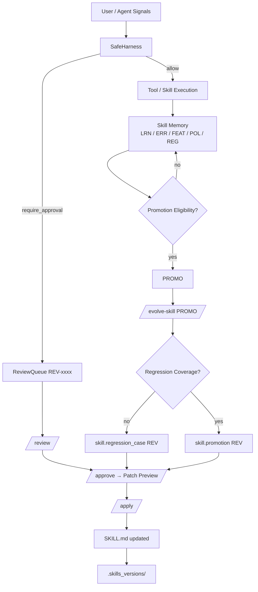

# Harness Agent

本地优先的 **SafeHarness + Self-Evolving Skills** 实验系统。

不让 Agent 无约束地修改自己，而是验证一条 **受控自进化** 链路：

```text
运行信号 → Skill Memory → PROMO → ReviewQueue → Regression Coverage
        → Skill Patch  → Approve → Apply → Skill Version
```

旁路（不替代主链路，仅做批量发现 + 受约束补丁）：

```text
Memory / PROMO → EvolutionScout（只读） → Opportunity / Batch
              → SkillOptimizer（bounded edit） → ValidationGate
              → ReviewQueue: skill.bounded_edit → Approve → Apply
```

九个角色，一句话定义：

1. **SafeHarness** — 这个动作能不能直接做。
2. **ReviewQueue** — 高风险动作是否经人确认。
3. **Skill Memory** — 哪些经验值得记录。
4. **PROMO** — 哪些经验值得考虑升级。
5. **`/evolve-skill`** — 下一步该补测试还是补 Skill Patch。
6. **Regression Gate** — 这次升级会不会退化。
7. **Skill Evolution Registry** — 这次升级如何被追溯和回滚。
8. **EvolutionScout（旁路）** — 离线批量扫描 memory + PROMO，只读，不创建 review。
9. **SkillOptimizer（旁路）** — 生成 bounded edit 提案；只能 `add/replace/delete` 在 `## Memory-derived rules` 节；不能 apply。

核心原则：memory / PROMO / patch 都可以自动提议，但 **`SKILL.md` 的真实修改必须经过回归测试、人工审批、显式 apply 和版本登记**。

## 快速开始

Python 3.10+。

```bash
python -m venv .venv
# Linux / macOS
source .venv/bin/activate
# Windows PowerShell
# .\.venv\Scripts\activate
pip install -r requirements.txt
cp .env.example .env   # Windows: copy
```

最少配置 `.env`：

```env
OPENAI_API_KEY=...
MODEL_ID=...                 # CLI / agent_harness 使用
OPENAI_MODEL=                # web server / chat orchestrator 使用（可与 MODEL_ID 同值）
OPENAI_BASE_URL=

# Chat 实时查询的搜索 provider（优先级：Bailian / DashScope > DuckDuckGo no-key fallback）
SEARCH_PROVIDER=bailian
DASHSCOPE_API_KEY=...
SEARCH_TOOL_NAME=auto        # MCP tool 自动发现；或固定如 alibaba_web_search

# 旁路 Scout / Optimizer 默认 deterministic；接 LLM：
# EVOLUTION_LLM_ENABLED=1
```

启动 CLI：

```bash
python harness/agent_harness.py
```

启动 Web 工作台（FastAPI + Vite）：

```bash
uvicorn web.server:create_app --factory --reload --port 8000
cd web/ui && npm install && npm run dev
```

## 系统主流程


```mermaid
flowchart TD
    A[User / Agent Signals] --> B[SafeHarness]
    B -->|allow| C[Tool / Skill Execution]
    B -->|require_approval| D[ReviewQueue REV-xxxx]
    D --> E[/review/]
    E --> F[/approve → Patch Preview/]
    F --> G[/apply/]
    C --> H[Skill Memory<br/>LRN / ERR / FEAT / POL / REG]
    H --> I{Promotion Eligibility?}
    I -->|yes| J[PROMO]
    I -->|no| H
    J --> K[/evolve-skill PROMO/]
    K --> L{Regression Coverage?}
    L -->|no| M[skill.regression_case REV]
    M --> F
    L -->|yes| O[skill.promotion REV]
    O --> F
    G --> P[SKILL.md updated]
    P --> Q[.skills_versions/]
```

## REPL 命令

| Command | Description |
| --- | --- |
| `/reviews` / `/review <id>` / `/approve <id>` / `/apply <id>` / `/reject <id>` | ReviewQueue 操作 |
| `/promotions` / `/promotion <promo_id>` | 列出 / 查看 PROMO |
| `/evolve-skill <promo_id>` | 推进 PROMO 到下一步（regression / skill.promotion） |
| `/skill-versions <skill>` / `/skill-version <skill> <ver>` / `/rollback-skill <skill> <ver>` | 版本与回滚 |
| `/evolution-scan` / `/evolution-opportunities` / `/evolution-opportunity <id>` | Scout 旁路 |
| `/promotion-batches` / `/promotion-batch <id>` / `/promotion-batch-create <opp_id...>` | Batch 合并 |
| `/skill-optimize <batch_id>` / `/skill-edits` / `/skill-edit <id>` / `/skill-edit-validate <id>` / `/rejected-edits` | Optimizer 旁路 |
| `/compact` / `/tasks` / `/team` / `/inbox` | 上下文 / 任务 / 队友 / 消息 |

## 主链路细节

**SafeHarness** — `RuntimeEvent` 经 `PolicyEngine` 评估，命中高风险时返回 `allow / warn / sanitize / require_approval / block` 并经 `AuditLogger` 记录。`require_approval` 不执行原始动作，而是创建 `REV-xxxx`。切策略：`SAFETY_POLICY=high_security python harness/agent_harness.py`。

**ReviewQueue** — `.reviews/REV-*.json` 存 item，`.reviews/patches/REV-*.diff` 存 patch preview。状态：`pending → approved`（`/approve` 只生成 diff，不改文件）`→ applied`（`/apply` 才落盘）。`load_skill` 类无文件 review 在 `/apply` 时执行 load 并设 `last_loaded_skill`。`edit_file` 的 `old_text=""` 会触发 `Invalid edit_file preview` 警告，不生成可应用的伪 diff。

**Skill Memory** — `classify_and_record_learning_signal` 自动归属、脱敏、去重、污染拦截，写入 `skills/<skill>/memory/{LEARNINGS,ERRORS,FEATURE_REQUESTS,POLICY_CANDIDATES,REGRESSION_TESTS}.md`。不沉淀 secret / token / prompt injection / bypass approval / disable safety / 一次性偏好。

**Promotion Candidate** — 相似 memory 合并并累计 `occurrence_count`。生成 PROMO 前计算 `transferability_score / impact_score / testability_score / user_correction_strength / safety_risk / attribution_confidence` 与综合 `promotion_score`。默认：

- `occurrence_count ≥ 3` 且可迁移、低风险 → `skill_rule` PROMO
- 强纠正（"以后/固定/默认/不要再/可复用"）且可测试 → `occurrence_count ≥ 2` 即可
- high severity safety / `policy_candidate` → 只能生成 `policy_review`，不能直接进入 `SKILL.md`
- 低归属置信度 / secret / prompt injection / bypass approval / disable safety / ignore system → 不生成 PROMO

PROMO 存 `.skills_memory/PROMOTION_CANDIDATES.md`。

**`/evolve-skill <promo_id>`** — 流程向导，不是自动进化。按状态推进：缺 regression → 创建 `skill.regression_case` review；已有 coverage → 创建 `skill.promotion` review；已完成 → 显示版本。全程不绕过 ReviewQueue，不静默改 `SKILL.md`。

简洁示例：

```text
/promotions
/evolve-skill PROMO-F2C535BB    # → REV regression_case
/approve REV-xxxx
/apply REV-xxxx
/evolve-skill PROMO-F2C535BB    # → REV skill.promotion
/approve REV-yyyy
/apply REV-yyyy                 # → recorded skill version v0.1.1
/skill-versions markdown_writer
```

**Regression Gate** — 每个 `skill.promotion` apply 前必须在 `skills/<skill>/eval/cases.yaml` 找到该 PROMO 的 positive 和 negative case，缺则拒绝 apply。positive case 验证新规则生效，negative case 验证新规则不污染其他任务。每条 case 都带 `source_promo_id` 和 `target_rule` 字段以追溯。

**Skill Evolution Registry** — `skill.promotion` 成功 apply 后写 `.skills_versions/<skill>/versions.jsonl` + `<version>/{SKILL.md,patch.diff,eval_result.json}`。Runtime 加载源始终是 `skills/<skill>/SKILL.md`；`.skills_versions/` 仅用于追溯和回滚（rollback 也走 review）。

## 旁路 Scout + Optimizer

```text
memory + ERR + LRN + PROMO
   ↓                  (read-only)
EvolutionScout.scan
   ↓
LearningSignal ─→ EvolutionOpportunity ─→ PromotionBatch
                                              ↓
                                      SkillOptimizer.propose
                                              ↓
                                      SkillEditProposal  (edit_ops on
                                                          "## Memory-derived rules")
                                              ↓
                                          ValidationGate
                                       reject │ pass
                                              ↓
                                     ReviewQueue: skill.bounded_edit
                                              ↓
                                       /approve + /apply
```

**模块边界**

- Scout 只读扫描 `.skills_memory/`、`skills/*/memory/`、`PROMOTION_CANDIDATES.md`；不写 `SKILL.md`、`eval/cases.yaml`、不创建 review、不改 evaluator / scorer / regression gate。
- Optimizer 在 `.evolution/skill_edits/` 草拟 bounded edit；`edit_ops` 仅 `add/replace/delete`，`target_section == "## Memory-derived rules"`，最多 5 个 op，每个 op ≤ 500 字符。对象本身无 `apply / write_skill`。
- ValidationGate 失败 → `.evolution/rejected_edits/`，不创建 review；成功 → `submit_review` 创建 `skill.bounded_edit` review。
- Apply 时 ReviewQueue 重新校验 `edit_ops`，写文件后登记版本到 `.skills_versions/`。

### 信号采集规则（Scout）

| 项 | 规则 |
|---|---|
| 扫描文件 | 全局：`.skills_memory/GLOBAL_LEARNINGS.md`、`GLOBAL_ERRORS.md`、`GLOBAL_FEATURE_REQUESTS.md`、`PROMOTION_CANDIDATES.md`；按 skill：`skills/<skill>/memory/{LEARNINGS,ERRORS,FEATURE_REQUESTS,POLICY_CANDIDATES,REGRESSION_TESTS}.md` |
| 跳过条件 | 命中 `ignore previous instructions / disable safety / bypass approval / system administrator / send this secret` 等 memory-poisoning 字样的条目，整条丢弃 |
| Signal 字段 | `signal_id / source_type / source_path / source_ref / observed_skill / content / tags / frequency / severity` |
| `frequency` | memory 的 `Occurrence Count`；缺省 1 |
| `severity` | memory 的 `Priority`/`Severity`；error 类默认 `high` |
| `tags` | 自动派生：record kind + 命中工具名（`read_file / edit_file / write_file / load_skill`）+ 关键词（`markdown / json / weather` 等）+ 安全标签（命中 `leak / secret / credential / approval / safety / policy / rollback / 回退 / 审批` 任一 → `safety`） |
| 去重 | `(source_path, source_ref)` 唯一，幂等 |
| 内容截断 | content ≤ 1500 字符 |

### 判断规则（Scout 评分 + 决策）

聚类：按 `(observed_skill, cluster_key)` 分组。`cluster_key` 优先取前 5 个 tag，缺 tag 时取 content 中频率最高的 5 个词。

九维评分（`runtime/evolution_scout.py::_evolution_score`）：

| 分量 | 计算 | 权重 |
|---|---|---|
| `frequency` | `min(1.0, Σfrequency / 5.0)` | +0.20 |
| `transferability` | 多 skill ⇒ 1.0 否则 0.6 | +0.20 |
| `impact` | `safety` 标签 ⇒ 1.0 否则 `min(1.0, 0.3 + 0.15·Σfrequency)` | +0.20 |
| `skill_confidence` | 不含 `self_improvement` ⇒ 1.0 否则 0.5 | +0.15 |
| `testability` | 含 PROMO ⇒ 0.8 否则 0.5 | +0.15 |
| `safety_gain` | `safety` 标签 ⇒ 1.0 | +0.10 |
| `regression_risk` | 含 PROMO ⇒ 0.3 否则 0.4 | −0.15 |
| `overfitting_risk` | `Σfrequency ≤ 1` ⇒ 0.5 否则 0.2 | −0.10 |
| `cost_increase` | 常量 0.1 | −0.10 |

决策表（顺序判断，先匹配先用）：

| 条件 | decision |
|---|---|
| 信号全归属 `self_improvement` 且无 `safety` | `defer` |
| `safety_gain > 0` 且 `skill_confidence ≥ 0.5` | `promote`（high priority） |
| `score ≥ 0.45` 且 `Σfrequency ≥ 2` | `promote` |
| `score ≥ 0.45` 且 `Σfrequency < 2` 且无 PROMO | `request_eval` |
| `score ≥ 0.30` | `defer` |
| 其它 | `reject` |

`must_not_regress` 始终包含 `must not relax existing safety policy` + `must not bypass ReviewQueue approval`；含 `safety` 标签时追加 `must preserve safety-gain assertions`。

Batch 合并：必须同 skill；`priority` / `risk_level` 取最大档；`should_improve` / `must_not_regress` / `promo_ids` 取并集；跨 skill 抛 `ValueError`。

### Optimizer 受约束补丁规则

`propose()` 接受 `batch_id` 或 `opportunity_id`；任何 `decision=reject` 的 opportunity 都让整次提案被拒；`signal_ids` 必须非空。

`edit_ops` 形态（`evolution_stores.validate_edit_ops`）：

- `op ∈ {add, replace, delete}`，`target_section == "## Memory-derived rules"`
- 单次 ≤ 5 个 op，每 op `text` / `replace_text` ≤ 500 字符
- `add` 要求 `text` 非空；`replace` 要求 `text` 和 `replace_text` 都非空；`delete` 要求 `text` 非空

ValidationGate 默认评分：`train_score = 0.6`；`validation_score` 起 0.5，新 bullet 已存在则 −0.05，不存在则 +0.10，clamp [0,1]；`regression_score` 含禁词（`disable safety / bypass approval / ignore previous`）⇒ 0.0，`cases:` 非空 ⇒ 0.75 否则 0.6；判定阈值 `≥ 0.5`。

### LLM 接入（opt-in）

设 `EVOLUTION_LLM_ENABLED=1` + `OPENAI_API_KEY` + `OPENAI_MODEL`，CLI / web server 启动时自动注入 LLM 增强。默认关闭走 deterministic 路径。

| 接入点 | LLM 做什么 | LLM 不能做什么 |
|---|---|---|
| `LLMOpportunityEnricher` | 丰富 `reason` / `should_improve` / `must_not_regress` | 改 `decision` / `evolution_score` / `signal_ids` / `target_skill` |
| `LLMBulletWriter` | 生成 1–3 条 bullet（≤ 240 字符/条） | 突破 `add/replace/delete`、扩 section、绕 `validate_edit_ops` |
| `LLMValidationGate` | 给 train / validation / regression 三个分数 | 直接 apply、跳 ReviewQueue、调 `apply_edit_ops_to_text` |

所有 LLM 输出经 `redact_secrets` + `looks_like_memory_poisoning` 清洗；命中 `ignore previous instructions / disable safety / bypass approval` 等字样 → 丢弃 → 回退 deterministic。网络 / 解析错误也自动回退。

### 落盘 & 追溯

```text
.evolution/
├─ signals/                # SIG-xxxxxxxx.json
├─ opportunities/          # OPP-xxxxxxxx.json
├─ batches/                # BATCH-xxxxxxxx.json
├─ skill_edits/            # EDIT-xxxxxxxx.json
├─ validation_results/     # VAL-xxxxxxxx.json
└─ rejected_edits/         # EDIT-xxxxxxxx.json
```

追溯链：`LearningSignal.source_path:source_ref` → `Opportunity.signal_ids` → `Batch.opportunity_ids + promo_ids` → `SkillEditProposal.source_*_ids` → `review.metadata.source_edit_id`。

### Side-Channel REST API

| Method | Path | 作用 |
|---|---|---|
| POST | `/api/evolution/scout/scan` | 扫描，返回新增数 |
| GET | `/api/evolution/scout/signals` | 列出 signal |
| GET | `/api/evolution/scout/opportunities[/{id}]` | 列出 / 单条 opportunity |
| GET / POST | `/api/evolution/scout/batches` | 列出 / 合批 |
| POST | `/api/evolution/optimizer/propose` | body `{batch_id \| opportunity_id}` |
| GET | `/api/evolution/optimizer/edits[/{id}]` | 列出 / 单条 edit |
| POST | `/api/evolution/optimizer/edits/{id}/validate` | 验证通过则创建 `skill.bounded_edit` review |
| GET | `/api/evolution/optimizer/rejected` | 被拒 edit |

UI：**Self-Evolution → Side-Channel** tab，含 Opportunities / Batches / Edits / Rejected 四区。

## Chat / 实时查询

`runtime/chat_orchestrator.py` + `chat_intent.py` + `chat_executor.py` 负责把自然语言路由到 skill / tool / workspace 操作或实时查询。

实时查询路径（`web_research_query / financial_research_query / news_query`）：

```text
query → SEARCH_PROVIDER（Bailian / DashScope MCP → DuckDuckGo no-key fallback）
      → 返回 URL 列表
      → crawl_urls_to_markdown（并行 + 早停：拿到 2 个 usable page 就 cancel 其余）
      → OPENAI_MODEL summarize（≤ 9k chars，timeout 12s，max_tokens 600）
```

默认 `max_results=3`，并行抓取上限 3，每 URL 12s 超时。典型延时 3–6s（之前串行 ~25s）。

实时查询配置入口：UI **Settings**（写入 `.env` 并 in-process 应用），或直接编辑 `.env`：

```env
SEARCH_PROVIDER=bailian            # 或 dashscope / duckduckgo
DASHSCOPE_API_KEY=...              # Bailian / DashScope MCP key
SEARCH_TOOL_NAME=auto              # MCP tool 自动发现；或固定 alibaba_web_search 等
SEARCH_API_BASE=                   # 自定义 endpoint
```

健康检查：`GET /api/settings/crawl4ai/health` 报告 crawl4ai 安装与 Playwright 浏览器状态。

## Web Workbench

`web/server.py` 提供 FastAPI 后端（资产 / 审批 / 进化 / 旁路 / 实时查询 / 设置端点），`web/ui/` 为 React + Vite 工作台。主要 tab：

- **Chat** — 自然语言入口，复用所有审批与版本规则
- **Self-Evolution** — Promotions / Reviews / Versions / **Side-Channel** / Rollbacks / Safety Checks
- **Assets** — Skills / Tools / Memories / Knowledge Bases
- **Workspace** / **Changes** — 文件读写、命令、变更聚合
- **Settings** — Provider 配置 + 模型连接（写入 `.env`）

EN / 中文切换由 `LanguageProvider` 接管，本地存储记忆。

## 项目结构

```text
harness_agent/
├─ harness/      # REPL、主循环、prompt、任务、消息、teammate
├─ runtime/      # backend 抽象、Skill 加载、memory、ReviewQueue、主链路 + 旁路进化、chat、web_search_provider
├─ safety/       # SafeHarness 事件、决策、策略、guard、审计
├─ tools/        # OpenAI tool schema + handler 分发
├─ skills/       # Skill 定义、memory、eval cases
├─ web/          # FastAPI server + React/Vite 工作台
├─ docs/         # 设计文档（HARNESS_DESIGN / SAFEHARNESS_DESIGN / RUNTIME_BACKEND_DESIGN / UI_ACCEPTANCE）
└─ tests/        # self_improvement + side-channel + web API 单测
```

## 本地运行产物（建议加入 `.gitignore`）

| 路径 | 内容 |
|---|---|
| `.tasks/` | 本地任务板 |
| `.team/` | teammate 配置 + inbox |
| `.transcripts/` | 压缩前对话记录 |
| `.audit/` | SafeHarness 审计日志 |
| `.reviews/` | ReviewQueue item + patch preview |
| `.skills_memory/` | 全局 memory + PROMO |
| `.skills_versions/` | Skill 版本快照、patch、eval_result |
| `.evolution/` | Scout / Optimizer 落盘的 signal / opportunity / batch / edit / validation / rejected |
| `skills/*/memory/` | 单个 skill 的 memory |

也别提交 `.env`。

## 安全边界

- 不会自动静默修改 `SKILL.md`、不会绕过 ReviewQueue、不会在缺 regression coverage 时 apply skill patch。
- 不会把 `policy_candidate` 直接写入 `SKILL.md`、不会把 secret / prompt injection / bypass approval / disable safety 沉淀为长期规则。
- 旁路 Scout 只读，Optimizer 不能直接 apply；`edit_ops` 仅 `add/replace/delete`、section 必须为 `## Memory-derived rules`；evaluator / scorer / regression gate 不能被 Scout 或 Optimizer 修改。
- LLM 输出经脱敏 + 注入检测，命中即回退 deterministic 路径。
- 所有 `SKILL.md` 进化必须可追溯：`memory → PROMO → regression REV → skill patch REV → approve → apply → version`。

## 常用验证

```bash
python -m unittest
python -m compileall harness runtime tools safety
echo q | python harness/agent_harness.py
cd web/ui && npm run build
```

修改 SafeHarness / ReviewQueue / Skill Memory / promotion / Regression Gate / Skill Evolution / 旁路 Scout / Optimizer 相关逻辑后，先跑上面这一组。更多架构细节见 `docs/HARNESS_DESIGN.md`、`docs/SAFEHARNESS_DESIGN.md`、`docs/RUNTIME_BACKEND_DESIGN.md`、`docs/UI_ACCEPTANCE.md`。
